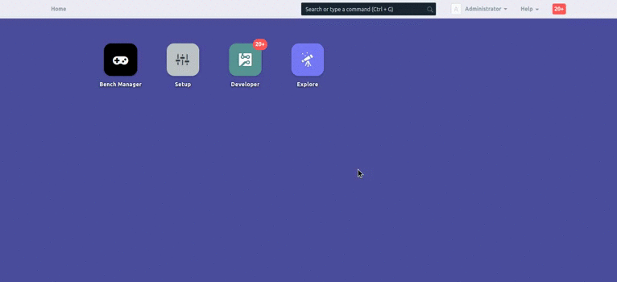

# Bench Manager

Bench Manager is a graphical user interface to emulate the functionalities of Frappé Bench. Like the command line utility it helps you install apps, manage multiple sites, update apps and much more.

## Installation

Create a new site called bench-manager.local and install Bench Manager on the site. 

``` bench setup manager```

## Features

#### What can you do using this app ?
- Update bench
- Backup your sites
- Install/Uninstall apps on your site
- Restore Backups on either existing sites or new sites
- Create new apps and sites

#### App Catalogue

There are 4 main doctypes associated with this app. 

### 1. App

- This doctype shows a list of all installed apps in the current bench Instance.
- The New button in this doctype emulates the ```bench new-app <app-name>``` command.


### 2. Bench Settings

- This is a single doctype whose main purpose is to peruse your bench instance and load all the necessary config onto the related doctypes such as App, Site and Site Backup.
- The Update button emulates the ``` bench update ``` command and updates all the installed apps.
- The Sync button does the following functions.
  - Reads your bench instance, greps and loads all the backups onto the Site Backup doctype.
  - Reads, greps and populates the Site doctype with all the existing sitse in the current bench instance.
  - Reads, greps and populates all the installed apps in the App doctype.
- The Bench setting doctype also displays all the config parameters in the common-site-config.json which is applicable to all 
  the sites in your bench instance.


### 3. Site

* The Site doctype shows a list of all the sites in the current bench instance.
* Inside each individual docname of the Site doctype one can find 3 clickable buttons.
  1. Migrate
      * This button emulates the ```bench migrate``` command.
      * It applies schema changes and data migrations if any.
      * Migrate should be run after you pull updates from any Frappé app.
  2. Backup Site 
      * This button backs up the site with all the files ie. it emulates ``` bench update ```
      * By default the sites are backed up with all the files
  3. Install App
      * On clicking this button a ui-dialog pops up where one can select and install any app onto the site.
  4. Uninstall App
      * Lets you uninstall an app from the site.


### 4. Site Backup

- This doctype contains a list of all the backups present in your bench instance (includes both existent and archived sites).
- Inside each individual docname one can find a Restore button.
- Clicking the Restore button pops up a ui-dialog.
- In this ui-dialog once chose whether to restore the backup either on an existing site or on a new site.


### 5. Bench Manager Command

- This doctype is basically a logger for all the commands run using this app.
- This doctype displays the source of the command ie. the doctype and docname from where the command originated.
- It also displays the date and time on which the command was executed.
- The status of the command can be one of 3 types (Success, Failed or Ongoing)
- Finally the console text field displays the log of the command.


#### License

MIT
